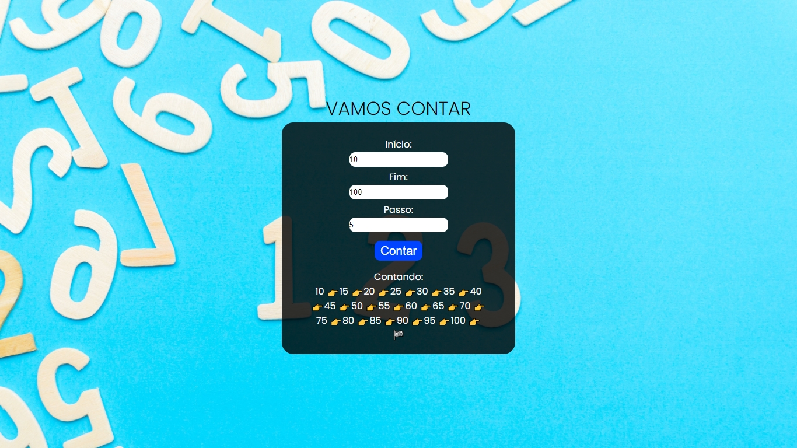
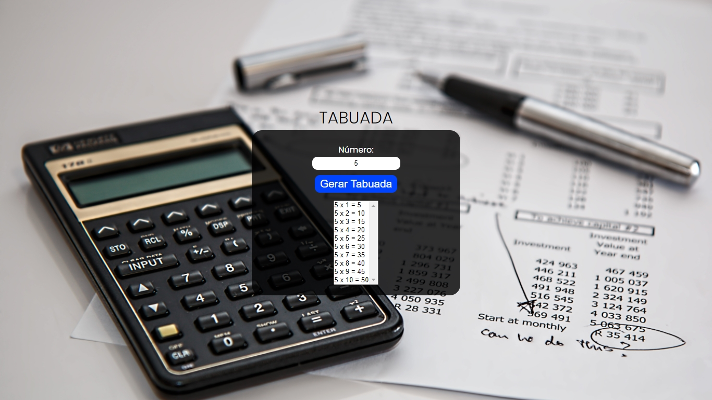
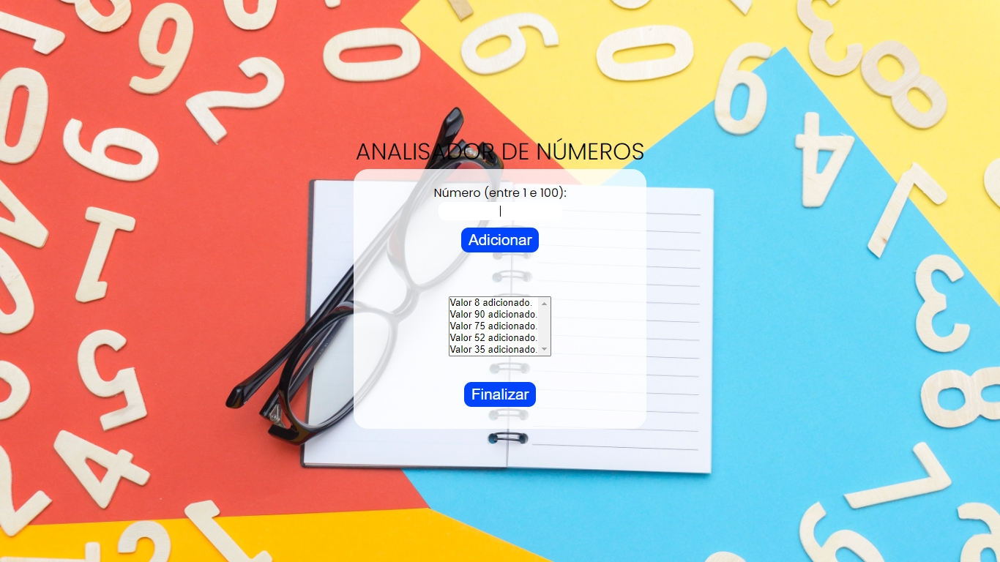
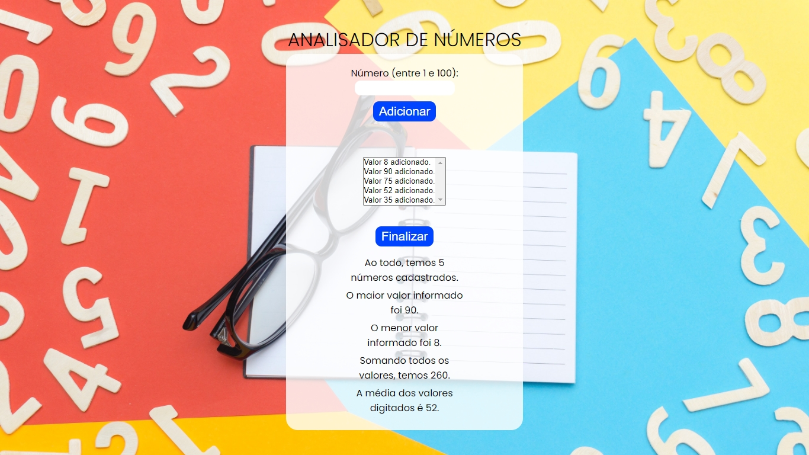

<h1 align="center">:books: Projetos do Curso em Vídeo (JavaScript) :books:</h1>

<p align="center">

</p>

<p align="center">Olá! Seja bem-vindo ao meu repositório de projetos realizados durante meu aprendizado no Curso em Vídeo de JavaScript do Prof. Guanabara.
Aqui você irá encontrar os projetos que desenvolvi durante as aulas do curso.</p>

<p align="center"><a href="https://www.cursoemvideo.com/course/javascript/">Link do curso</a></p>

<h2 align="center"> :computer: Tecnologias Utilizadas :computer:</h2>

<p align="center">
  
  
  
</p>

<h2 align="center">:rocket: Projetos Desenvolvidos :rocket:</h2>

<details>
  <summary>Hora do dia</summary>
  <p>Uma aplicação JavaScript. Ela busca a hora no seu sistema operacional e mostra diretamente no navegador.</p>
  
  
  
  <p align="center"><a href="https://github.com/matheusz98/projetos-curso-em-video/tree/master/Projeto%20Hora%20do%20dia">Hora do dia</a></p>
</details>

<details>
  <summary>Verificador de idade</summary>
  <p>Uma aplicação JavaScript. A aplicação calcula a idade e o gênero do usuário ao inserir as informações.</p>
  
  
  
  
  
  <p align="center"><a href="https://github.com/matheusz98/projetos-curso-em-video/tree/master/Projeto%20Verificador%20de%20idade">Verificador de idade</a></p>
</details>

<details>
  <summary>Contador de números</summary>
  <p>Uma aplicação JavaScript. Ao inserir um número inicial, um final e quantos números deseja pular, ele mostra o resultado na tela.</p>
  
  <p align="center"><a href="https://github.com/matheusz98/projetos-curso-em-video/tree/master/Projeto%20Contador%20de%20números">Contador de números</a></p>
</details>

<details>
  <summary>Tabuada</summary>
  <p>Uma aplicação JavaScript. Ao inserir um valor, será calculado a tabuada deste valor.</p>
  
  <p align="center"><a href="https://github.com/matheusz98/projetos-curso-em-video/tree/master/Projeto%20Tabuada">Tabuada</a></p>
</details>

<details>
  <summary>Analisador de números</summary>
  <p>Uma aplicação JavaScript. Ao inserir valores, será calculado a quantidade, o maior e o menor entre eles, a soma e a média dos valores.</p>
  
  
  <p align="center"><a href="https://github.com/matheusz98/projetos-curso-em-video/tree/master/Projeto%20Analisador%20de%20números">Analisador de números</a></p>
</details>

```bash
# Clonar o repositório
$ git clone https://github.com/matheusz98/projetos-curso-em-video

# Ou
# Ir no code (botãozinho verde) e fazer download do zip.

```

<h2 align="center">Muito obrigado pela visita! :smile: :grinning: </h2>
